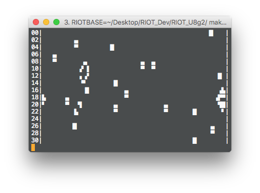

# Game of Life

## Introduction
This example demonstrates Conway's Game of Life running on RIOT-OS, outputting the board via U8glib display and graphics driver.

## Usage
Assuming you've cloned this repository, run `RIOTBASE=/path/to/RIOT make`, then `RIOTBASE=/path/to/RIOT make term`.

## Used libraries and modules.
* xtimer &mdash; time management
* random &mdash; generate random board
* u8glib &mdash; display driver (to stdout)

## Game rules
The following rules apply to the game:

 * A cell is born, if it has exactly three neighbours.
 * A cell dies of loneliness, if it has less than two neighbours.
 * A cell dies of overcrowding, if it has more than three neighbours.
 * A cell survives to the next generation, if it does not die of loneliness or overcrowding.
